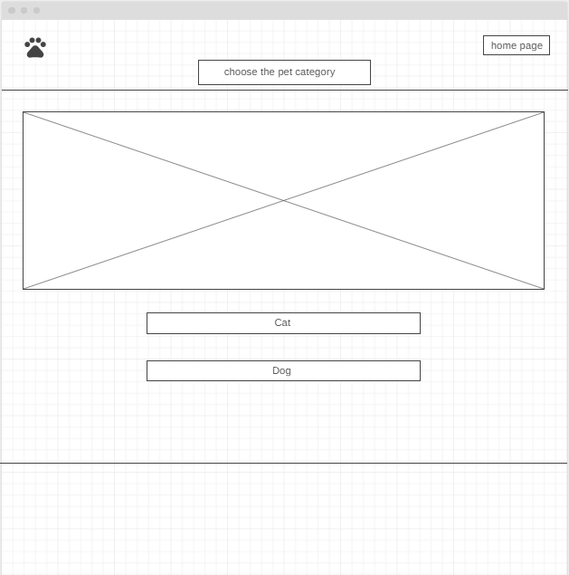

# Real business-related problem 
A company's current or long-term challenges and issues are referred to as business problems. These can make it difficult for a company to carry out its strategy and meet its objectives. Business difficulties can sometimes jeopardize a company's long-term viability. 
Even though every project is different and unique, projects that fail typically have the same problems. It's not difficult to find examples of failed efforts, but determining why they failed might be more difficult. Even if a project is finished on time and on budget, it can still fail if the desired results and quality are not achieved.
It's hard to call it a triumph. We'll look at the ten most common issues that lead to project failure.

**A Problem-Based Requirement**
To have a deeper understanding of their customers, businesses must manually harvest data from multiple platforms.
At best, this is an incomplete need because the business problem definition does not explain the genuine need on its own. What situations do businesses require data for, and what do they aim to achieve with it? Why is it a problem, and so on?
Assume you develop functionality to automate data extraction from several platforms. Because the value objective was never established as part of the business requirement, there's a significant chance those features will miss the mark if you don't grasp why and how that data will be used, as well as the desired consequences.

### Challenges in Business and How to Overcome Them:

**1. Lack of accountability**
- When each member of a project team feels accountable and strives to fulfill the function that has been allocated to them, the team performs exceptionally effectively. An entire project can be sunk due to a lack of accountability on the part of team members.

**How to deal with it:**
- Effective project managers delegate responsibilities to team members and guide the group toward the common goal of finishing the project on time and on budget. It's critical to have a project management application that allows you to allocate and track duties. Having regular check-ins within the team also encourages accountability.

**2. Lack of communication**
- Effective project management communication is critical to the project's success. To guarantee that all stakeholders are involved in the process, you must have timely and transparent communication techniques. Miscommunication is especially hazardous to project teams since it interferes with their ability to operate together. It can lead to disagreements among team members and, as a result, the project may be delayed.

**How to deal with it:**
- To keep everyone up to date, project managers frequently use various collaboration and project management tools available on the market. These collaboration technologies not only make it easier for managers to carry out their responsibilities, but they also assure greater project transparency and team accountability. Contextual comments, @mentions, and priority assignment capabilities are used to accomplish this.
Furthermore, having regular, short stand-up meetings a few times a week can help prevent misinterpretation.

**3. Poor planning at the beginning stage**
- Included are ineffective prioritization, a lack of a comprehensive business plan, and a failure to break down the development into phases.

**How to deal with it:**
- Dealing with a variety of strategies, such as CLEAR and SMART, can assist a project manager in developing a set of successful goals from the outset of a project, allowing them to overcome project management barriers.

**4. spending  time  correcting issues  after projects have gone live**
- There will likely be some issues here and there, but this is a frequent problem brought about by a focus on manufacturing.

**How to deal with it:**
- Provide extra time to test your work from the beginning. Double your typical testing time if necessary. Indeed, it will put even more strain on your schedule, but it will be well worth it in the long term.

**User and System Requirements:**

1. User requirements:

- Add to cart. 
- Flip cards.
- Buttons.
- Slide show pictures.
- Animation .

2. system requirements:

- local storage. 
- Functionality. 

---

**Identify areas of risk related to the successful completion of your application.**

- Performance Risk:

Performance risk refers to the possibility that the project may fail to deliver results that are consistent with the project specifications.
This is a broad threat that cannot be traced to a single political party.
Even if a project team completes the project on schedule and on budget, the intended outputs and benefits are not achieved. Performance risk, on the other hand, can add to cost and schedule risk when a team's or technology's performance increases the project's cost and length.
Overall, the company lost money and time on a project that did not work out.

- Schedule Risk:

Schedule risk is the possibility that work will take longer than expected, and it is frequently the result of poor preparation. It is closely linked to cost risk, because schedule slippages typically increase costs and postpone the project's completion, as well as its benefits. Missed deadlines and a potential loss of competitive advantage are both consequences of delays. Schedule risk leads to cost risk because longer projects cost more. It can also result in performance hazards, such as failing to meet the deadline for accomplishing the targeted goal.

---

**First, we wrote a plan for our project and discussed ideas with our team; once we agreed on one, we began collecting requirements, wireframes, and determining the best method for storing data in our project; and finally, we created a plan for the work, as well as a schedule for the tasks; and finally, we managed the work of the team members, with each team member having a specific task.**

**List of requirements**
1. User requirements:

- Add to cart. 
- Flip cards.
- Buttons.
- Slide show pictures.
- Animation .

2. system requirements:

- local storage. 
- Functionality.

**DataBase & WireFrame**

- DataBase: We designed a form that contains the image of the pet and its name, as well as a button that returns the information to the local storage.

- WireFrame:

---
---

**Activity Diagram**

**Coding and implementation technique**

-We adopted agile approach, and the team divided the project into tasks, with each member focusing on a single task.

**Testing technique**
- Black Box Testing is a software testing method in which the tester has no knowledge of the thing being tested's internal structure, design, or implementation.
- We used this method to assess software program functionality without knowing the actual code structure, implementation details, or internal paths.

### References:
1. [https://kissflow.com/project/project-management-challenges/](https://kissflow.com/project/project-management-challenges/).
2. [https://www.proficientz.com/business-problem-definition/](https://www.proficientz.com/business-problem-definition/).